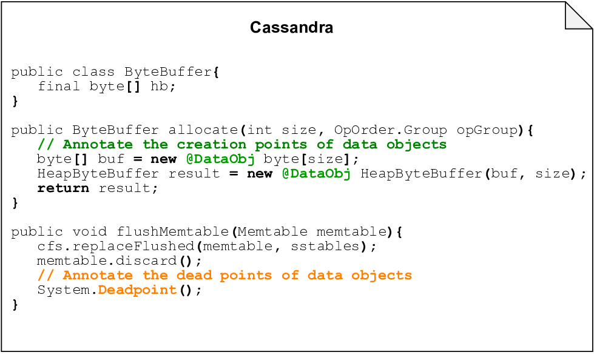
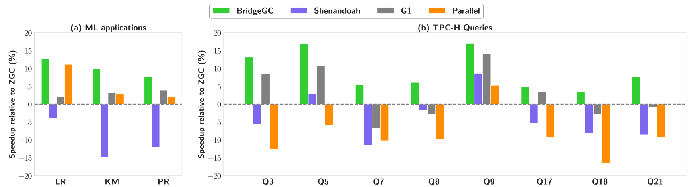
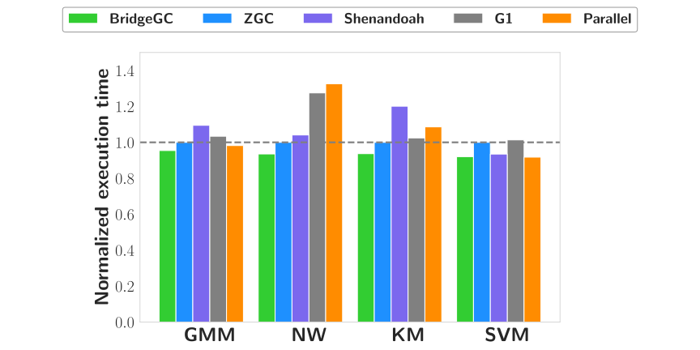
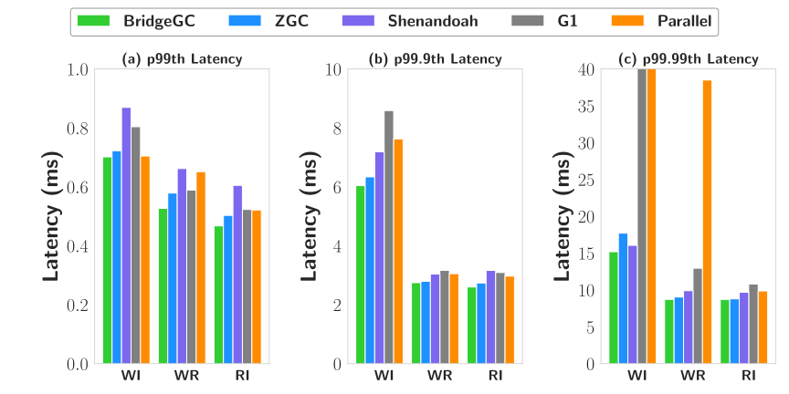

# BridgeGC
BridgeGC is an efficient semi-automatic garbage collector for big data frameworks such as Flink and Spark. Specially, BridgeGC is built on [OpenJDK 16 HotSpot](https://github.com/openjdk/jdk16) to reduce the GC time spent on long-lived data objects generated by the frameworks. As shown in Figure 1, BridgeGC uses limited manual annotations at the creation/release points of data objects to profile their life cycles, then BridgeGC leverages the life cycles information of annotated data objects to efficiently allocate them in JVM heap and reclaim them without unnecessary marking/copying overhead.

**Figure 1: Comparison between BridgeGC and traditional GC.**

# Usage

## Build

Download our source code, follow the [instructions](https://openjdk.org/groups/build/doc/building.html) to build the OpenJDK JVM, resulting in a JVM with BridgeGC. 

## Annotations
We provide two simple annotations, `@DataObj` and `System.Deadpoint()`, that can be used by the framework developers to annotate the creation and release of data objects. Specifically, the annotation `@DataObj` is used along with the keyword `new` to denote the creation of data objects. The annotation `System.Deadpoint()` is used to denote the release of a batch of data objects. We show how we apply annotations in Spark, Flink and Cassandra briefly as follows and more details can be found [here](Apply/README.md).

**Figure 2: Apply BridgeGC annotations to `MemorySegment`.**

**Figure 3: Apply BridgeGC annotations to chunked `ByteBuffer`.**

**Figure 4: Apply BridgeGC annotations to `MemoryBlock`.**

**Figure 5: Apply BridgeGC annotations to `ByteBuffer` for Memtable.**

## Run
After adding the annotations, compile the framework. Before running the framework, just add `-XX:+UseBridgeGC` to JVM parameters of the executor/server to enable BridgeGC.

# Implementation
We design three components in BridgeGC to efficiently profile, allocate, and reclaim annotated data objects.

## Precise Data Object Profiler
The profiler is designed to identify data objects and track the life cycles of data objects through annotations, it processes `@DataObj` and `System.Deadpoint()` annotations at the runtime to inform the garbage collector of allocation and reclaimable time of data objects.

## Memory-Efficient Label-Based Allocator
The allocator separates the storage of data objects and normal objects in data pages and normal pages, and tackles the problem of space balance by dynamic page allocation. To distinguish data objects readily at the GC level, the allocator labels them using colored pointer.

## Effective Marking/Copying-Conservation Collector 
The collector skips marking labeled data objects and excludes data pages from reclamation in GC cycles where data objects are known to be lived, and performs effective reclamation of data pages only after some annotated data objects are released at the framework level.

# Evaluation
We apply and evaluate BridgeGC with Flink 1.9.3, Spark 3.3.0, and Cassandra 4.0.6. We compare BridgeGC with all available garbage collectors in OpenJDK 16, includes ZGC, Shenandoah, G1, and Parallel. 
<!-- We also compare BridgeGC with a state-of-the-art research work [ROLP](https://rodrigo-bruno.github.io/papers/rbruno-eurosys19.pdf).-->
## Flink
We select four representative TPC-H queries, i.e., Query5 (TQ5), Query8 (TQ8), Query9 (TQ9), Query21 (TQ21), defined in the [TPC-H end-to-end test](https://github.com/apache/flink/tree/master/flink-end-to-end-tests/flink-tpch-test), and two batch applications from the official Flink examples as supplements, i.e., Linear Regression (LR) and KMeans (KM). We run these applications with setting `MemorySegment` to three sizes: 32KB, 16KB, and 4KB, with heap size of the executor set to 32GB.

Results show that BridgeGC reduces concurrent GC time by 42\%-87\% compared to the baseline ZGC. In terms of application execution time, BridgeGC reduces by 4\%-24\% compared to ZGC, and outperforms other evaluated collectors as shown in Figure 6.   

**Figure 6: Execution time of applications in Flink under different memory segment sizes.** Results are normalized to ZGC.

## Spark
We choose four representative applications from [HiBench](https://github.com/Intel-bigdata/HiBench) as main test objectives, including Gaussian Mixture Model (GMM), NWeight (NW), KMeans (KM), and Support Vector Machine (SVM). We configure the upper bound of each chunked `ByteBuffer` to 32KB, and set the heap size of the executor to 32GB.

Results show that BridgeGC reduces concurrent GC time by 19\%-73\% compared to the baseline ZGC. In terms of application execution time, BridgeGC reduces by 5\%-8\% compared to ZGC, and outperforms other evaluated collectors as shown in Figure 7.

**Figure 7: Execution time of HiBench applications in Spark using different collectors.** Results are normalized to ZGC.

## Cassandra

We choose three representative workloads [YCSB](https://github.com/brianfrankcooper/YCSB), including write-intensive workload (WI) that inserts 2M records into the database, write-read workload (WR) that consists of 1M read record operations and 1M modify record operations, and read-intensive workload (RI) that consists of 1.9M read record operations and 100K modify record operations. We take the default to allocate Memtable in heap memory using `ByteBuffer`, and set the heap memory of Cassandra server to 16GB, with permitted memory for Memtable to 8GB. 

Results show that BridgeGC has negligible GC pause time, and the concurrent
marking time of BridgeGC is 37%-68% less than ZGC. In terms of application execution time, BridgeGC improves the throughput performance under all three workloads compared to ZGC by 1.1%-2.6%. In terms of latency, BridgeGC leads to the best average latency as well as tail latency compare to other evaluated collectors. As shown in Figure 8, the 𝑝99𝑡ℎ , 𝑝99.9𝑡ℎ , and 𝑝99.99𝑡ℎ tail latency of BridgeGC are on average 6.3%, 3.8%, and 6.2% lower than ZGC respectively.

**Figure 8: Tail latency comparison between different garbage collectors in Cassandra workloads.**

rushb
