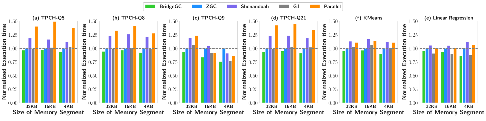
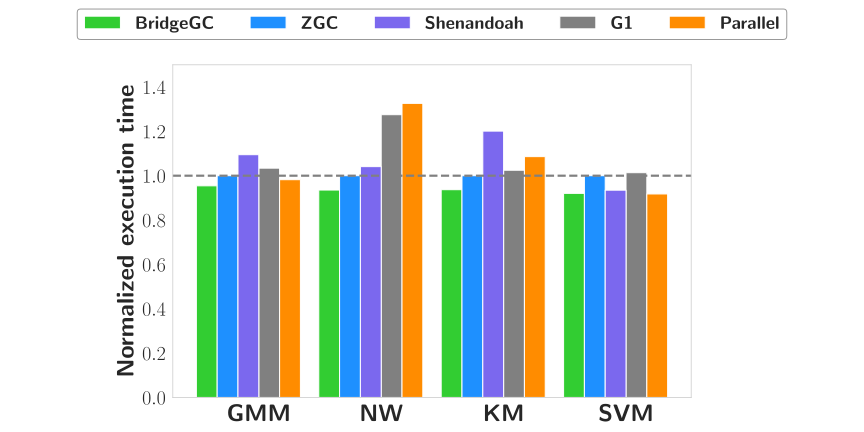
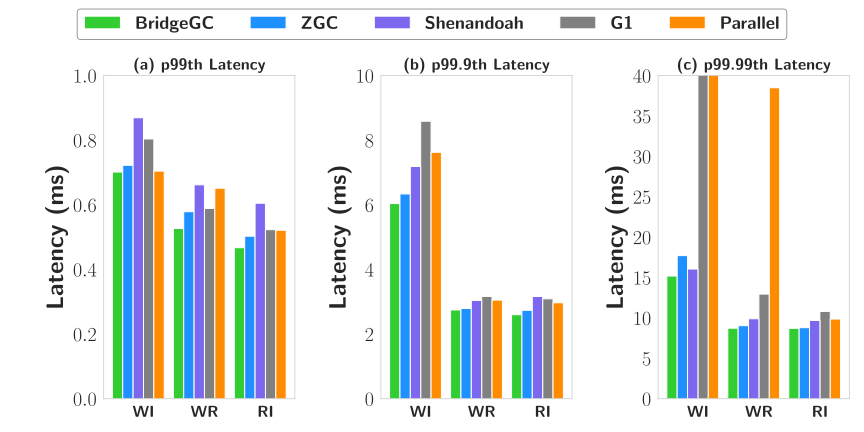

# BridgeGC

BridgeGC is a semi-automatic garbage collector built on OpenJDK 16 HotSpot aiming at reducing GC time of long-lived data objects.

For more details, please refer to our [paper](./).

# Usage

## Build & Run

Download the source of BridgeGC and [OpenJDK-16](https://github.com/openjdk/jdk16), put BridgeGC-src in place of src in OpenJDK-16, then follow the [building-doc](https://github.com/openjdk/jdk16/blob/master/doc/building.html) to build the JDK, and use it like OpenJDK. Add `-XX:+UseBridgeGC` to enable BridgeGC.

## Use BridgeGC in Flink

BridgeGC accurately manage long-lived objects with hints added manually. To make BridgeGC effectual, hints should be applied at the framework level to data objects with features of long-lived, great amount, and a simple reference relationship. These objects contribute most GC overhead. Abstracted data objects, for example [MemorySegment](https://github.com/apache/flink/blob/master/flink-core/src/main/java/org/apache/flink/core/memory/MemorySegment.java) in [Flink](http://flink.apache.org/), are generally the ideal target and widely used in modern big data frameworks. As they have a simple reference relationship and are explicitly created and released, only limited efforts are needed to add the annotations.

```java
public class MemorySegment {
  // Simple reference relationship
  protected final byte[] heapMemory;
}
```

MemorySegment is allocated to specific tasks for operations like cache and shuffle, the primitive byte array it holds would serve as a memory page to store serialized records, which by defaults could take 70% space of heap memory, and they are released at the end of the task. MemorySegment is explicitly created and released in fixed functions, hints(annotation `@DataObj` and function `Deadpoint`) could be easily applied in these functions.

BridgeGC identifies target data objects and manages their creation by leveraging hints at their allocation sites. The annotation `@DataObj` for keyword `new` is added to the codes of creation functions where data objects are allocated. During object allocation at GC level, BridgeGC determines a memory request as an allocation of data object if it is annotated, and places the object into a special region.

```java
pubic MemorySegment allocateSegment(int size) {
  // Hint for identification
  byte[] backup = new @DataObj byte[size];
  MemorySegment res = new @DataObj MemorySegment(backup);
  return res;
}
```

To realize the life cycles of all data objects and reclaim them, hints at their release function signal common dead points. The Java System Method `System.Deadpoint()` is added in the release functions after all data objects are explicitly released by frameworks. BridgeGC would determine some data objects have finished their life cycles and become reclaimable after receiving a signal of `System.Deadpoint()`.

```java
void release(Collection<MemorySegment> segments) {
  while (segments.hasNext()) {
    final MemorySegment seg = segments.next();
    seg.free();
  }
  segments.clear();
  // Hint for reclamation
  System.Deadpoint();
}
```

## Use BridgeGC in Spark

Abstracted data objects in [Spark](http://spark.apache.org/) is [MemorySegment](https://github.com/apache/spark/blob/master/common/unsafe/src/main/java/org/apache/spark/unsafe/memory/MemoryBlock.java). The role of MemoryBlock is similar, it would be allocated when SparkSQL is performing a sort operation, with a primitive long array to hold binary data. They will be released when the operation is finished, which makes them also long-lived in long-running tasks. MemoryBlock is also explicitly created and released in fixed functions.

```java
public class MemoryBlock{
  // Simple reference relationship
  Object array;
}

public MemoryBlock allocate(long size){
  // Hint for identification
  long[] array = new @DataObj long[numWords];
  MemoryBlock memory = new @DataObj MemoryBlock(array, size);
  return memory;
}

public long cleanUpAllAllocatedMemory(){
  for (MemoryBlock page : pageTable) {
    memoryManager.tungstenMemoryAllocator().free(page);
  }
  // Hint for reclamation
  System.Deadpoint();
}
```

`java.nio.ByteBuffer` are also used as abstracted data objects in Spark. Annotations can be applied to chunked ByteBuffers, which are created to store serialized data of cached RDD with the byte array they hold, and they are released when the cached RDD is spilled to disk.

```java
public class ByteBuffer{
  // Simple reference relationship
  final byte[] hb;
}

public ByteBuffer allocate(int size, OpOrder.Group opGroup){
  // Hint for identification
  byte[] buf = new @DataObj byte[size];
  HeapByteBuffer result = new @DataObj HeapByteBuffer(buf, size);
  return result;
}
```

## Use BridgeGC in Cassandra

In [Cassandra](http://cassandra.apache.org), annotations are applied to long-lived ByteBuffers used in Memtable. Memtable buffers recent writes in memory, which is flushed to disk when it reaches a threshold, and millions of ByteBuffers are referenced by Memtable to hold buffered data, which are discarded when the Memtable is flushed.

```java
public class ByteBuffer{
  // Simple reference relationship
  final byte[] hb;
}

public ByteBuffer allocate(int size, OpOrder.Group opGroup){
  // Hint for identification
  byte[] buf = new @DataObj byte[size];
  HeapByteBuffer result = new @DataObj HeapByteBuffer(buf, size);
  return result;
}

public void flushMemtable(Memtable memtable){
  cfs.replaceFlushed(memtable, sstables);
  memtable.discard();
  // Hint for reclamation
  System.Deadpoint();
}
```

# Results

## Flink

Execution time of applications in Flink under different memory segment sizes(results are normalized to ZGC):



## Spark

Execution time of [Hibench](https://github.com/Intel-bigdata/HiBench) applications in Spark under different collectors(results are normalized to ZGC):



## Cassandra

Tail latency comparison between different garbage collectors in Cassandra workloads:


