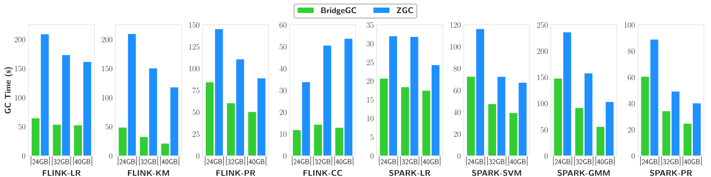
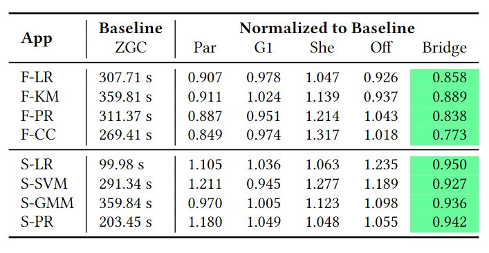

# BridgeGC
BridgeGC is an efficient cross-level garbage collector for big data frameworks such as Flink and Spark. Specially, BridgeGC is built on [OpenJDK 17 HotSpot](https://github.com/openjdk/jdk17) to reduce the GC time spent on long-lived data objects generated by the frameworks. As shown in Figure 1, BridgeGC uses limited manual annotations at the creation/release points of data objects to profile their life cycles, then BridgeGC leverages the life cycles information of annotated data objects to efficiently allocate them in JVM heap and reclaim them without unnecessary marking/copying overhead.

**Figure 1: Comparison between BridgeGC and traditional GC.**

# Usage

## Build

Download our source code, follow the [instructions](https://openjdk.org/groups/build/doc/building.html) to build the OpenJDK JVM, resulting in a JVM with BridgeGC. 

## Annotations
We provide two simple annotations, `@DataObj` and `System.Reclaim()`, that can be used by the framework developers to annotate the creation and release points of data objects. Specifically, the annotation `@DataObj` is used along with the keyword `new` to denote the creation of data objects. The annotation `System.Reclaim()` is used to denote the release of a batch of data objects. We show how we apply annotations in Spark, Flink and Cassandra briefly as follows and more details can be found [here](Apply/README.md).

**Figure 2: Apply BridgeGC annotations to `MemorySegment`.**

**Figure 3: Apply BridgeGC annotations to chunked `ByteBuffer`.**

**Figure 4: Apply BridgeGC annotations to `MemoryBlock`.**

**Figure 5: Apply BridgeGC annotations to `ByteBuffer` for Memtable.**

## Run
After adding the annotations, compile the framework. Before running the framework, just add `-XX:+UseBridgeGC` to JVM parameters of the executor/server to enable BridgeGC.

# Implementation
We design three components in BridgeGC to efficiently profile, allocate, and reclaim annotated data objects.

## Precise Data Object Profiler
The profiler is designed to identify data objects and track the life cycles of data objects through annotations, it processes `@DataObj` and `System.Reclaim()` annotations at the runtime to inform the garbage collector of allocation and reclaimable time of data objects.

## Memory-Efficient Label-Based Allocator
The allocator separates the storage of data objects and normal objects in data pages and normal pages, and tackles the problem of space balance by dynamic page allocation. To distinguish data objects readily at the GC level, the allocator labels them using colored pointer.

## Effective Marking/Copying-Conservation Collector 
The collector skips marking labeled data objects and excludes data pages from reclamation in GC cycles where data objects are known to be lived, and performs effective reclamation of data pages only after some annotated data objects are released at the framework level.

# Evaluation
We apply and evaluate BridgeGC with Flink 1.9.3 and Spark 3.3.0. We compare BridgeGC with all available garbage collectors in OpenJDK 17, includes ZGC, G1, Shenandoah and Parallel. 
<!-- We also compare BridgeGC with a state-of-the-art research work [ROLP](https://rodrigo-bruno.github.io/papers/rbruno-eurosys19.pdf).-->

For Flink, we select four batch machine learning applications that are memory intensive from [Flink examples](https://github.com/apache/flink/tree/master/flink-exa) as the driving workload, including Linear Regression (LR), KMeans (KM), PageRank (PR), Components (CC). For Spark, we choose four representative ML applications from popular big data benchmark [HiBench](https://github.com/Intel-bigdata/HiBench), including Linear Regression (LR), Support Vector Machine (SVM), Gaussian Mixture Model (GMM) and PageRank (PR).

**Figure 6: The total concurrent GC time that BridgeGC and ZGC spend when running applications with different heap sizes.**

As the results shown in Figure 6, BridgeGC reduces concurrent GC time by 42\%-82\% compared to baseline ZGC. BridgeGC achieves lower GC time by consuming 7\%-13\% less memory than ZGC and having 2\%-52\% fewer GC cycle counts. Also, BridgeGC spends 31\%-46\% less marking time per GC cycle. 

**Figure 7: Execution time of applications under baseline ZGC and execution time of other collectors normalized to ZGC.**

In terms of application execution time, BridgeGC outperforms other evaluated collectors for all workloads and configurations as shown in Figure 7. Compared to the baseline ZGC, BridgeGC achieves 3%-29% speedup. BridgeGC also reduces up to 26% execution time compared to the default collector G1 in OpenJDK. BridgeGC can improve applications’ performance mainly due to fewer GC cycles and less GC overhead.   